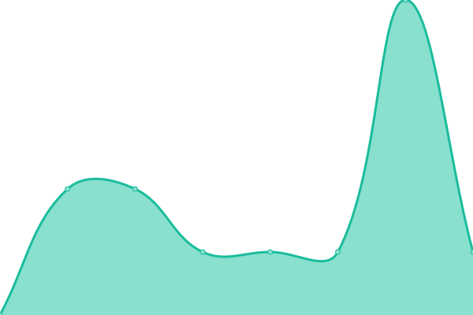
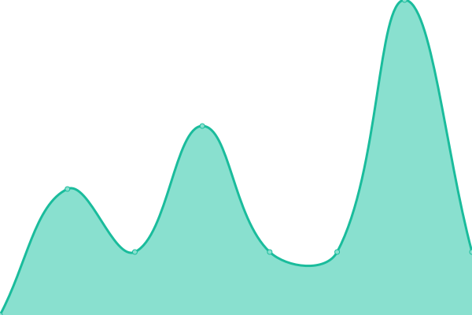

# [📈 Live Status](https://Jerome2103.github.io/uptime): <!--live status--> **🟩 All systems operational**

This repository contains the open-source uptime monitor and status page for [Yannik Jérôme Büchi](https://yannikb.ch/), powered by [Upptime](https://github.com/upptime/upptime).

With [Upptime](https://upptime.js.org), you can get your own unlimited and free uptime monitor and status page, powered entirely by a GitHub repository. We use [Issues](https://github.com/Jerome2103/uptime/issues) as incident reports, [Actions](https://github.com/Jerome2103/uptime/actions) as uptime monitors, and [Pages](https://Jerome2103.github.io/uptime) for the status page.

<!--start: status pages-->
<!-- This summary is generated by Upptime (https://github.com/upptime/upptime) -->
<!-- Do not edit this manually, your changes will be overwritten -->
<!-- prettier-ignore -->
| URL | Status | History | Response Time | Uptime |
| --- | ------ | ------- | ------------- | ------ |
|  [Google](https://www.google.ch) | 🟩 Up | [google.yml](https://github.com/Jerome2103/uptime/commits/HEAD/history/google.yml) | 

 144ms
     
 | 

<a href="https://Jerome2103.github.io/uptime/history/google">100.00%</a>
    

|  [Wikipedia](https://de.wikipedia.org) | 🟩 Up | [wikipedia.yml](https://github.com/Jerome2103/uptime/commits/HEAD/history/wikipedia.yml) | 

 308ms
     
 | 

<a href="https://Jerome2103.github.io/uptime/history/wikipedia">100.00%</a>
    

|  [Hacker News](https://news.ycombinator.com) | 🟩 Up | [hacker-news.yml](https://github.com/Jerome2103/uptime/commits/HEAD/history/hacker-news.yml) | 

 324ms
     
 | 

<a href="https://Jerome2103.github.io/uptime/history/hacker-news">100.00%</a>
    

|  CheckMK | 🟩 Up | [check-mk.yml](https://github.com/Jerome2103/uptime/commits/HEAD/history/check-mk.yml) | 

 837ms
     
 | 

<a href="https://Jerome2103.github.io/uptime/history/check-mk">100.00%</a>
    

|  [Google DNS 1](8.8.4.4) | 🟩 Up | [google-dns-1.yml](https://github.com/Jerome2103/uptime/commits/HEAD/history/google-dns-1.yml) | 

 6ms
     
 | 

<a href="https://Jerome2103.github.io/uptime/history/google-dns-1">100.00%</a>
    

|  [Google DNS 2](8.8.8.8) | 🟩 Up | [google-dns-2.yml](https://github.com/Jerome2103/uptime/commits/HEAD/history/google-dns-2.yml) | 

 6ms
     
 | 

<a href="https://Jerome2103.github.io/uptime/history/google-dns-2">100.00%</a>
    

<!--end: status pages-->

[**Visit our status website →**](https://Jerome2103.github.io/uptime)

## 📄 License

- Powered by: [Upptime](https://github.com/upptime/upptime)
- Code: [MIT](./LICENSE) © [Yannik Jérôme Büchi](https://yannikb.ch/)
- Data in the `./history` directory: [Open Database License](https://opendatacommons.org/licenses/odbl/1-0/)
